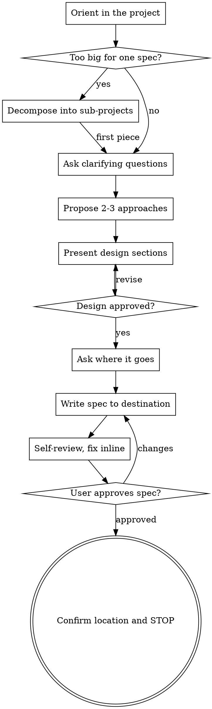

# /tospec — Idea to Approved Spec

Turn a half-formed idea into a written spec the user has read and approved.

The value here is the dialogue, not the document. A spec that captures assumptions the user never examined is worse than no spec — it launders guesswork into something that looks authoritative. So the questions come first, the document comes last, and the user signs off on both.

## When this runs

Only when the user explicitly invokes it. If you arrived here because a request merely *sounded* like it needed design work, back out and just do what was asked.

## The gate

While this skill is active, write no implementation code, scaffold no projects, install no dependencies, and invoke no implementation skill. Exploratory reading is fine and expected — that is how you orient. The distinction is between *learning about* the codebase and *changing* it.

This holds even when the request seems trivial. "Too simple to need a design" is exactly where unexamined assumptions do their damage, because nobody thinks to check them. A simple project just gets a short spec — three paragraphs is a legitimate spec — but it still gets one, and the user still approves it.

## Checklist

Track these as tasks and work them in order:

1. **Orient** — read the project: files, structure, docs, recent commits
2. **Scope check** — decide whether this is one spec or needs decomposing
3. **Question** — one at a time, until purpose, constraints, and success criteria are clear
4. **Approaches** — propose 2-3 with tradeoffs and a recommendation
5. **Present the design** — section by section, confirming as you go
6. **Place the spec** — ask where it should land, then write it there
7. **Self-review** — scan the written spec for the four failure modes below, fix inline
8. **Hand back** — user reviews it; revise until approved, then stop

## Flow



**The terminal state is an approved spec, sitting wherever the user chose to put it.** Do not roll on into planning or implementation — the user decides what happens next. Ending cleanly is what makes the skill safe to invoke.

## 1. Orient

Read before you ask. Questions you could have answered by looking at the repo waste the user's attention and signal you aren't paying attention. Check the structure, the README, existing patterns in the area being changed, and recent commits for direction of travel.

## 2. Scope check

Before refining details, judge the size. If the request spans multiple independent subsystems — "a platform with chat, file storage, billing, and analytics" — say so immediately. Refining the details of something that needs decomposing first is wasted work on both sides.

When it's too big, help split it: what are the independent pieces, how do they depend on each other, what order makes sense? Then spec the first piece through the normal flow. Each piece earns its own spec later.

## 3. Question

One question per message. If a topic has two dimensions, that's two messages.

This pacing feels slow and is the single most valuable thing the skill does. Batched questions get batched, shallow answers; a single question gets a considered one, and the answer usually reshapes what you'd ask next. Asking five upfront means four of them were based on a model of the problem you no longer hold.

Use `AskUserQuestion` when the options are genuinely enumerable — it's faster for the user than free-typing. Use plain prose when the answer is open-ended, because forcing open questions into multiple choice hides the option you didn't think of.

Aim at purpose, constraints, and success criteria. What is this for? What can't change? How will we know it worked?

## 4. Approaches

Propose 2-3 real alternatives with honest tradeoffs. Lead with your recommendation and say why — a menu with no opinion pushes the design work back onto the user, which is what they came here to avoid.

Apply YAGNI hard. Cut every feature that isn't load-bearing for the stated purpose. Speculative generality is the most common way specs get bloated, and it's cheapest to remove now.

## 5. Present the design

Scale each section to its complexity: a sentence or two when it's obvious, up to a few hundred words when it's genuinely subtle. Confirm after each section rather than delivering a monolith — course corrections are cheap mid-design and expensive after.

Cover architecture, components, data flow, error handling, and testing. Go back and re-ask if something stops making sense; discovering a misunderstanding here is a success, not a setback.

**Design for isolation.** Break the system into units with one clear purpose each, communicating through defined interfaces. For every unit you should be able to say what it does, how it's used, and what it depends on. If someone can't understand a unit without reading its internals, or you can't change its internals without breaking callers, the boundary is wrong.

This isn't only good engineering — it's what makes the thing implementable. Well-bounded units fit in context, and edits to focused files are more reliable than edits to sprawling ones.

**In existing codebases.** Follow the patterns already there. Where existing code genuinely obstructs the work — a file that's grown unmanageable, tangled responsibilities in the path you're changing — fold targeted cleanup into the design, the way a careful developer improves what they're touching. Don't propose unrelated refactoring; it inflates scope and gives the user something new to evaluate that they didn't ask for.

## 6. Place the spec

A spec has to land somewhere, and where it lands is the user's decision — a repo file, a tracker issue, and a shared doc serve different workflows, and picking wrong means the spec is in a place nobody working on it will look.

Once the design is approved, ask where it goes *before* writing it. `AskUserQuestion` fits this well. Offer what the environment actually supports rather than a generic menu — check for a git remote, an issue tracker, connected MCP integrations:

- **A file in the repo** — default to `docs/specs/YYYY-MM-DD-<topic>-design.md`, or match the project's existing spec location if it has one. Use today's real date; check it rather than guessing, since a wrong date makes the file sort incorrectly forever.
- **A tracker issue** — `gh issue create` where there's a GitHub remote, or the equivalent tool. The topic becomes the title, the spec becomes the body.
- **A connected doc tool** — Notion, Linear, or whatever integration is available in the session.
- **Nowhere** — leave it in the conversation, if that's all they wanted.

Skip the question when the user has already said where it should go; asking again just to be safe reads as not listening.

The structure is the same wherever it lands:

```markdown
# <Topic>

## Problem
What's broken or missing, and who feels it.

## Goals / Non-goals
What this does and explicitly does not do. Non-goals are what stop scope creep later.

## Approach
The chosen design and why, including what was rejected and the reason.

## Components
Each unit: purpose, interface, dependencies.

## Data flow
How information moves through the system.

## Error handling
What fails, how it's detected, what the user sees.

## Testing
How correctness gets verified.

## Open questions
Anything genuinely undecided — or omit this section entirely.
```

Drop sections that don't apply. An empty "Error handling" heading is noise.

**Write it, then leave it alone.** Don't commit the file, don't label or assign the issue, don't share the doc or notify anyone. Those are outward-facing acts the user hasn't asked for, and a spec that reaches other people before its author has read it is one they now have to walk back.

## 7. Self-review

Reread what you wrote with fresh eyes, looking for four specific failures:

1. **Placeholders** — any "TBD", "TODO", or section that trails off. Resolve them or move them to Open questions where they're honestly labeled.
2. **Contradictions** — does the architecture match the component descriptions? Do any two sections disagree?
3. **Scope** — is this one implementable unit of work, or did it quietly become three?
4. **Ambiguity** — could a requirement be read two ways? Pick one and say it plainly. An ambiguous spec gets resolved by whoever implements it, silently and possibly wrong.

Fix inline. No need to announce the review or re-run it.

## 8. Hand back

Say where it went and stop:

> Spec written to `<path>` / opened as issue #N. Have a read and let me know if you want changes.

Wait. If they want changes, make them and re-run the self-review. Once they approve, you're done.

What happens next is theirs to choose. Some want an implementation plan, some want to hand the spec to a colleague, some are done thinking for the day. Offering one of those is fine; assuming it and starting work is not — the whole reason this skill is safe to invoke on a half-formed idea is that it reliably stops.
